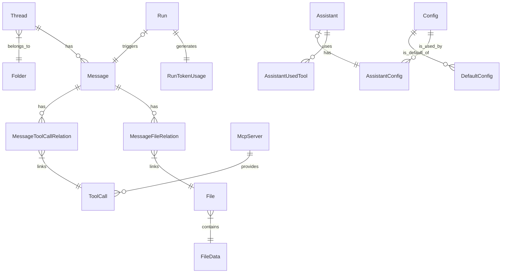

# データモデル設計書

## 1. 概要

本システムのデータストアにはリレーショナルデータベース (RDBMS) を使用する。
以下に主要なエンティティとその関係性を示す。

## 2. ER図 (概念)

## 3. エンティティ定義

### 3.1 会話管理

#### Thread (スレッド)

会話の単位。

- `id`: PK
- `title`: スレッドタイトル
- `folderId`: 所属フォルダID (FK)
- `userId`: 所有ユーザーID
- `defaultAssistantId`: デフォルトで使用するアシスタント

#### Message (メッセージ)

スレッド内の発言。

- `id`: PK
- `threadId`: 所属スレッドID (FK)
- `role`: 役割 (user, assistant, system)
- `content`: 本文
- `reasoning`: 思考プロセス (Chain of Thought)
- `index`: 順序

#### Folder (フォルダ)

スレッド整理用コンテナ。

- `id`: PK
- `name`: フォルダ名
- `color`: 表示色
- `userId`: 所有ユーザーID

### 3.2 アシスタント・設定

#### Assistant (アシスタント)

事前設定されたAIエージェント。

- `id`: PK
- `name`: 名前
- `description`: 説明
- `userId`: 所有ユーザーID

#### Config (設定)

AIモデルのパラメータ設定。

- `id`: PK
- `model`: 使用するモデルID (gpt-4o, gemini-pro 等)
- `systemPrompt`: システムプロンプト
- `maxTokens`, `maxContextWindow`: トークン制限
- `extraData`: その他パラメータ (JSON)

#### UserModel (ユーザーモデル)

ユーザーが独自に追加したモデル定義。

- `id`: PK
- `modelId`: 識別子
- `apiEndpoint`: APIエンドポイント
- `runnerType`: API種別 (openai, azure, etc)

### 3.3 ファイル・ツール

#### File & FileData

添付ファイル管理。メタデータ (`File`) とバイナリ実体 (`FileData`) を分離して管理。

- `File.path`: パス/名前
- `FileData.buffer`: バイナリデータ
- `FileData.mimeType`: MIMEタイプ

#### ToolCall & McpServer

ツール実行履歴とMCPサーバー設定。

- `McpServer`: 外部ツールサーバーの設定 (URL, OAuth情報)
- `ToolCall`: 実際に実行されたツールの記録 (関数名, 引数, 結果)

### 3.4 実行・ログ

#### Run & RunTokenUsage

AI実行のトランザクションとトークン消費ログ。

- `Run`: 実行ステータス
- `RunTokenUsage`: プロンプト/完了トークン数、コスト計算結果

## 4. 共通仕様

- **ID生成**: すべてのIDは、エンティティを識別可能なプレフィックス付きのユニーク文字列（CUID, UUIDv7等）とする (例: `thd_...`, `msg_...`)。
- **監査ログ**: `createdAt`, `updatedAt`, `userId` を主要なテーブルに保持し、作成日時、更新日時、作成者を追跡可能にする。
