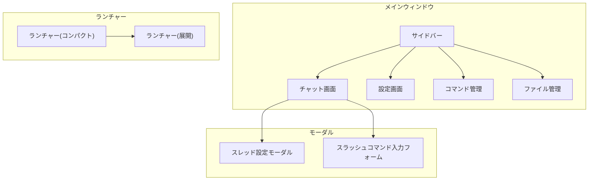
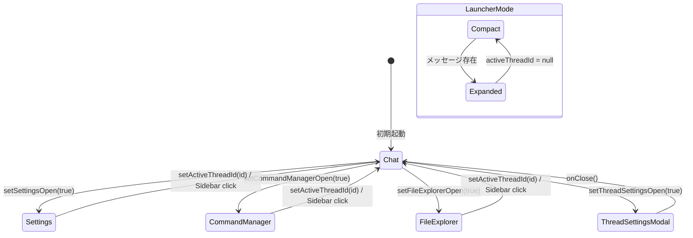

# 画面遷移仕様書 (Navigation Specification)

## 1. 概要

本アプリケーションは **SPA (Single Page Application)** として設計されており、URLベースのルーターは使用せず、Zustand ストア (`useAppStore`) 内のフラグ（`isSettingsOpen`, `isCommandManagerOpen`, etc.）と `activeThreadId` を組み合わせて画面内容を動的に切り替えます。

> [!IMPORTANT]
> このドキュメントは**あるべき仕様**を定義するものであり、現行実装の全てがこれに準拠しているとは限りません。実装修正の基準として活用してください。

---

## 2. アプリケーション状態 (App State)

画面表示を制御する主要な状態は以下の通りです：

| 状態変数             | 型                  | 説明                                     |
| -------------------- | ------------------- | ---------------------------------------- |
| `activeThreadId`     | `number \| null`    | 表示中のスレッドID（`null`で新規チャット/他画面） |
| `isSettingsOpen`     | `boolean`           | 設定画面表示フラグ                       |
| `isCommandManagerOpen` | `boolean`         | コマンド管理画面表示フラグ               |
| `isFileExplorerOpen` | `boolean`           | ファイル管理画面表示フラグ               |
| `isThreadSettingsOpen` | `boolean`         | スレッド設定モーダル表示（ローカルstate） |
| `isSidebarOpen`      | `boolean`           | サイドバー表示フラグ（レスポンシブ）     |
| `isLauncher`         | `boolean` (ローカル) | ランチャーモードかどうか                 |

---

## 3. 画面一覧

### 3.1 チャット画面 (`Chat`)
- **表示条件**: `!isSettingsOpen && !isCommandManagerOpen && !isFileExplorerOpen`
- **コンポーネント**: `App.tsx` 内のメインレンダリング部分
- **内容**: メッセージ一覧、入力エリア、ヘッダー（モデル選択、プロバイダー選択、スレッド設定ボタン）

### 3.2 設定画面 (`SettingsView`)
- **表示条件**: `isSettingsOpen === true`
- **コンポーネント**: `SettingsView.tsx`
- **サブタブ**: 一般 / AIプロバイダー / モデル設定 / MCPサーバー

### 3.3 コマンド管理画面 (`CommandManager`)
- **表示条件**: `isCommandManagerOpen === true`
- **コンポーネント**: `CommandManager.tsx`

### 3.4 ファイル管理画面 (`FileExplorer`)
- **表示条件**: `isFileExplorerOpen === true`
- **コンポーネント**: `FileExplorer.tsx`

### 3.5 スレッド設定モーダル (`ThreadSettingsModal`)
- **表示条件**: `activeThreadId !== null && isThreadSettingsOpen === true`
- **コンポーネント**: `ThreadSettingsModal.tsx`
- **親画面**: チャット画面上にオーバーレイ表示

### 3.6 ランチャーモード
- **判定**: Tauri ウィンドウラベルが `launcher` の場合
- **コンパクト表示**: `messages.length === 0 && !activeThreadId`
- **展開表示**: メッセージがある、または `activeThreadId` が設定されている場合

---

## 4. 画面遷移表

### 4.1 サイドバーからの遷移

| 遷移元     | トリガー                | 遷移先         | 状態更新                                             |
| ---------- | ----------------------- | -------------- | ---------------------------------------------------- |
| *(任意)*   | スレッドクリック        | チャット画面   | `setActiveThreadId(id)` ※副作用でフラグがリセット    |
| *(任意)*   | 「新しいチャット」ボタン | チャット画面   | `createThread()` → `setActiveThreadId(newId)`         |
| *(任意)*   | 「コマンド管理」ボタン  | コマンド管理   | `setCommandManagerOpen(true)`, `setActiveThreadId(null)` |
| *(任意)*   | 「ファイル管理」ボタン  | ファイル管理   | `setFileExplorerOpen(true)`, `setActiveThreadId(null)` |
| *(任意)*   | 「設定」ボタン          | 設定画面       | `setSettingsOpen(true)`, `setActiveThreadId(null)`   |

> [!NOTE]
> `setActiveThreadId(id)` が呼ばれると、`App.tsx` 内の `useEffect` で `isCommandManagerOpen`, `isSettingsOpen`, `isFileExplorerOpen` がすべて `false` にリセットされます。

### 4.2 チャット画面からの遷移

| 遷移元       | トリガー                     | 遷移先               | 状態更新                         |
| ------------ | ---------------------------- | -------------------- | -------------------------------- |
| チャット画面 | スレッド設定ボタン（⚙️）    | スレッド設定モーダル | `setThreadSettingsOpen(true)`    |
| チャット画面 | 「プロバイダー設定」リンク  | 設定画面             | `setSettingsOpen(true)`          |
| チャット画面 | 新規チャットボタン（➕）    | チャット画面（新規） | `setActiveThreadId(null)`        |

### 4.3 モーダルの閉じ方

| モーダル               | トリガー       | 戻り先     | 状態更新                        |
| ---------------------- | -------------- | ---------- | ------------------------------- |
| スレッド設定モーダル   | ✕ボタン/保存後 | チャット画面 | `setThreadSettingsOpen(false)`  |
| スラッシュコマンドフォーム | 確定/キャンセル | チャット画面 | `setSelectedCommand(null)`     |

### 4.4 ランチャーモード固有

| 状態             | トリガー         | 遷移/動作                         |
| ---------------- | ---------------- | --------------------------------- |
| コンパクト表示   | メッセージ送信   | 展開表示へ（ウィンドウリサイズ）  |
| *(任意)*         | Escapeキー       | ウィンドウを隠す（`hide()`）      |
| 展開表示         | 新規チャットボタン | コンパクト表示へ（状態リセット） |

---

## 5. 各画面への「戻る」操作

現在の実装では**明示的な「戻る」ボタンはありません**。代わりに以下のパターンで元の画面に戻ります：

| 現在の画面     | 戻り方法                                                              |
| -------------- | --------------------------------------------------------------------- |
| 設定画面       | サイドバーからスレッド選択、または「新しいチャット」ボタン             |
| コマンド管理   | サイドバーからスレッド選択、または「新しいチャット」ボタン             |
| ファイル管理   | サイドバーからスレッド選択、または「新しいチャット」ボタン             |
| モーダル       | 閉じるボタン（✕）またはオーバーレイ外クリック（実装依存）             |

> [!WARNING]
> **課題**: 各画面のヘッダーに「戻る」ボタンがないため、ユーザーはサイドバー操作に依存しています。UX向上のため、各サブ画面のヘッダーに「チャットに戻る」ボタンを追加することを推奨します。

---

## 6. 状態遷移図 (Simplified)

---

## 7. 推奨される改善点

### 7.1 「戻る」ナビゲーションの追加
- 設定/コマンド管理/ファイル管理の各ヘッダーに「チャットに戻る」ボタンを追加
- `setActiveThreadId(previousThreadId)` または `setActiveThreadId(null)` で遷移

### 7.2 URLベースの状態管理（オプション）
- 現状は全てストア管理だが、URLに状態を持たせることでブラウザ履歴/深リンクに対応可能
- 例: `#/settings`, `#/thread/123`

### 7.3 Escapeキーの統一動作
- モーダル → 閉じる
- サブ画面 (設定等) → チャットに戻る
- ランチャーモード → ウィンドウ非表示

---

## 8. コンポーネント・状態マッピング表

| コンポーネント          | ファイルパス                             | 担当する画面/機能         |
| ----------------------- | ---------------------------------------- | ------------------------- |
| `App.tsx`               | `src/App.tsx`                            | ルートレイアウト、条件分岐 |
| `Sidebar.tsx`           | `src/components/Sidebar.tsx`             | サイドバーナビゲーション   |
| `SettingsView.tsx`      | `src/components/SettingsView.tsx`        | 設定画面ラッパー           |
| `GeneralSettings.tsx`   | `src/components/GeneralSettings.tsx`     | 一般設定タブ               |
| `ProviderSettings.tsx`  | `src/components/ProviderSettings.tsx`    | AIプロバイダー設定タブ     |
| `ModelSettings.tsx`     | `src/components/ModelSettings.tsx`       | モデル設定タブ             |
| `McpServerSettings.tsx` | `src/components/McpServerSettings.tsx`   | MCPサーバー設定タブ        |
| `CommandManager.tsx`    | `src/components/CommandManager.tsx`      | コマンド管理画面           |
| `FileExplorer.tsx`      | `src/components/FileExplorer.tsx`        | ファイル管理画面           |
| `ThreadSettingsModal.tsx` | `src/components/ThreadSettingsModal.tsx` | スレッド設定モーダル       |
| `SlashCommandForm.tsx`  | `src/components/SlashCommandForm.tsx`    | スラッシュコマンド入力フォーム |
| `SlashCommandSuggest.tsx` | `src/components/SlashCommandSuggest.tsx` | スラッシュコマンドサジェスト |
| `ChatInputArea.tsx`     | `src/components/ChatInputArea.tsx`       | チャット入力エリア         |
| `ChatMessage.tsx`       | `src/components/ChatMessage.tsx`         | チャットメッセージ表示     |
| `useAppStore.ts`        | `src/store/useAppStore.ts`               | グローバル状態管理ストア   |

---

## 9. 改版履歴

| 日付       | バージョン | 変更内容       |
| ---------- | ---------- | -------------- |
| 2026-01-04 | 1.0        | 初版作成       |
